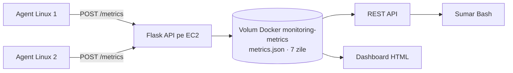

# Agent-Based Monitoring

Proiect DevOps pentru monitorizarea hosturilor Linux cu agenti Python si un server central.

## Ce face

Agentii colecteaza periodic utilizarea CPU, memoria, discul si numarul de procese. Trimit esantioanele prin HTTP catre serverul central Flask, care le salveaza in JSON. API-ul ofera lista hosturilor si ultima valoare pentru fiecare. Dashboard-ul HTML afiseaza metricile recente si marcheaza agentii ca online/offline.

Serverul adauga `received_at` in UTC si pastreaza metricile din ultimele 7 zile. Inregistrarile expirate sunt eliminate la urmatorul POST. Daca serverul nu raspunde, agentul inregistreaza eroarea si reincearca la ciclul urmator. `systemd` porneste agentul la boot si il reporneste dupa o terminare neasteptata.

## Arhitectura



## Tehnologii

- Python si `psutil` pentru colectarea metricilor.
- Flask pentru API si dashboard.
- Docker si Compose pentru serverul central si volumul persistent.
- Docker Hub pentru imaginea containerului.
- Ansible si `systemd` pentru configurarea serverului si agentilor.
- Jenkins pentru build, publicarea imaginii si deployment.
- Terraform si AWS pentru EC2, retea, security group si state remote in S3.

## Structura repository-ului

- `agent/`: codul agentului, dependentele si rularea manuala.
- `server/`: aplicatia Flask, dashboard-ul si dependentele serverului.
- `docker/`: Dockerfile si fisierul Compose.
- `ansible/`: playbook, configurare, inventar generat si `requirements.yaml`.
- `bash/summary.sh`: sumar al metricilor prin API.
- `terraform/`: infrastructura, variabile si outputs.
- `Jenkinsfile`: pipeline-ul principal CI/CD.
- `Jenkinsfile.destroy`: pipeline separat pentru stergerea infrastructurii.

## API

| Metoda | Endpoint | Descriere |
| --- | --- | --- |
| POST | `/metrics` | Primeste un esantion JSON de la agent si adauga `received_at`. |
| GET | `/machines` | Listeaza hosturile cunoscute. |
| GET | `/machines/<hostname>` | Returneaza ultima metrica pentru host. |
| GET | `/` | Afiseaza dashboard-ul HTML. |

Exemple, dupa deploy:

```bash
curl "http://<EC2_PUBLIC_IP>:5000/machines"
curl "http://<EC2_PUBLIC_IP>:5000/machines/agent-1"
```

Dashboard: `http://<EC2_PUBLIC_IP>:5000/`.

API-ul expune ultima metrica pentru fiecare host; endpoint pentru interogarea unei serii istorice nu exista momentan, desi JSON-ul pastreaza pana la 7 zile de esantioane.

## Pipeline Jenkins

La push pe branch-ul `main`, Jenkins:

1. Face checkout.
2. Initializeaza backend-ul S3 si ruleaza Terraform apply.
3. Ia IP-ul EC2 din output si genereaza `ansible/inventory`.
4. Construieste imaginea `orlandor99/monitoring-server:latest` si o publica pe Docker Hub.
5. Instaleaza colectia `community.docker 3.13.3` din `ansible/requirements.yaml`.
6. Verifica accesul SSH si ruleaza playbook-ul Ansible.

Pipeline-ul aplica Terraform automat la fiecare build. Verifica schimbarile Terraform inainte de push si nu rula pipeline-ul `Jenkinsfile.destroy` decat cand doresti sa elimini infrastructura.

## Configurare

### AWS si Terraform

- Bucket-ul backend `monitor-s3-bucket-state` trebuie sa existe in regiunea `eu-central-1` inainte de `terraform init`.
- `terraform/terraform.tfvars` contine AMI-ul, CIDR-ul VPC si ruta implicita. Actualizeaza AMI-ul pentru regiunea si imaginea folosite.
- In configuratia clonata, `default_cidr` este `0.0.0.0/0`. `main.tf` foloseste aceeasi variabila pentru regulile inbound ale porturilor 22 si 5000, dar si pentru egress.
- `ssh_key_path` are implicit `~/.ssh/id_rsa.pub`. Terraform extinde calea cu `pathexpand()`.
- Fisierul cu cheia publica trebuie sa existe pe masina care ruleaza Terraform. In Jenkins, `~` indica home-ul utilizatorului Jenkins.
- Cheia publica folosita de Terraform trebuie sa corespunda cheii private din Jenkins Credential `ssh-key-monitor`.

### Credentiale Jenkins

Creeaza credentialele cu ID-urile folosite in `Jenkinsfile`:

- `aws_credentials`: access key si secret key AWS.
- `dockerhub-credentials`: utilizator si parola/token Docker Hub.
- `ssh-key-monitor`: cheia privata SSH pentru EC2 si hosturile agent.

Instaleaza pe Jenkins CLI-urile Terraform, Ansible si Docker, plus pluginurile Git, Pipeline si Docker Pipeline.

Adresele si utilizatorii agent-1/agent-2 sunt definite in `ansible/generate_inventory.sh`: `192.168.56.102`/`vm1` si `192.168.56.103`/`vm2`. Adapteaza-le mediului tau.

## Rulare manuala a agentului

Pe hostul agentului, cu Python 3:

```bash
cd agent
python3 -m venv .venv
source .venv/bin/activate
pip install -r requirements.txt
MONITORING_SERVER_URL="http://<EC2_PUBLIC_IP>:5000/metrics" AGENT_INTERVAL=5 python agent.py
```

Alternativ, `agent/run.sh` instaleaza dependentele si seteaza intervalul la 10 secunde. Seteaza `MONITORING_SERVER_URL` inainte de pornire.

## Sumar Bash si verificari

Din radacina repository-ului, cu Bash, `curl`, `jq` si acces la output-ul Terraform:

```bash
cd bash
./summary.sh
```

Sau indica explicit URL-ul serverului:

```bash
MONITORING_SERVER_URL="http://<EC2_PUBLIC_IP>:5000" ./summary.sh
```

Pe hostul agentului poti verifica serviciul si logurile cu:

```bash
sudo systemctl status monitoring_agent
sudo journalctl -u monitoring_agent -f
```

Pe EC2, logurile serverului sunt disponibile prin:

```bash
docker logs -f --tail=100 monitoring-server
```

## Persistenta datelor

Compose monteaza volumul numit `monitoring-metrics` in container la `/server/data`, unde aplicatia scrie `metrics.json`. Volumul supravietuieste stergerii si recrearii containerului. Un `docker compose down` obisnuit nu sterge volumul; `docker compose down -v` il sterge.

Volumul este local pe instanta EC2. **`terraform destroy` sterge EC2 si volumul cu metrici.** Bucket-ul S3 configurat in Terraform pastreaza state-ul Terraform, nu datele aplicatiei. Pentru a pastra datele dupa stergerea EC2 ar trebui un backup separat; configuratia actuala nu face acest lucru.

Schimbarea de la vechiul bind mount la volumul numit nu copiaza automat fisierul `metrics.json` existent. Copiaza istoricul in volumul Docker inainte de primul deploy cu noua configuratie, daca trebuie pastrat.

Serverul citeste si rescrie intregul fisier JSON la fiecare POST. Implementarea este potrivita pentru dimensiunea proiectului, dar volumul de lucru creste cu numarul de agenti si esantioane. Nu se foloseste SQL.

## Limite si securitate

Configuratia curenta este potrivita pentru o demonstratie de curs:

- Security group-ul permite momentan acces public pe porturile 22 si 5000, deoarece `default_cidr` este `0.0.0.0/0`. Portul 80 nu este configurat si aplicatia nu il foloseste.
- Jenkins a raportat IP-ul public de iesire `188.26.8.196`. Acesta nu este inca configurat ca allowlist in clona curenta. Restrange SSH la Jenkins si API-ul la IP-urile publice de iesire ale agentilor si ale utilizatorilor dashboard-ului.
- Separa variabilele CIDR inbound de egress inainte sa schimbi `default_cidr`: Terraform o foloseste in prezent si pentru traficul outbound necesar descarcarii pachetelor si imaginilor Docker.
- API-ul nu are autentificare sau HTTPS.
- `ansible/ansible.cfg` dezactiveaza verificarea cheilor host SSH, convenabila pentru EC2 cu IP dinamic, dar fara verificarea identitatii hostului.
- Flask porneste cu `debug=False` si `use_reloader=False`, dar foloseste serverul integrat Flask. Pentru productie, foloseste un server WSGI.

`Jenkinsfile.destroy` ruleaza `terraform destroy -auto-approve`. Acesta elimina instanta EC2 si datele metricilor de pe volumul local. Ruleaza jobul doar cand accepti aceasta pierdere.
