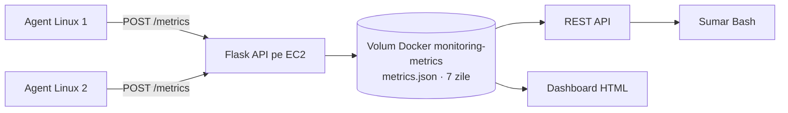

# Agent-Based Monitoring

Proiect DevOps pentru monitorizarea hosturilor Linux cu agenți Python și un server central.

## Ce face

Agenții colectează periodic utilizarea CPU, memoria, discul și numărul de procese. Trimit eșantioanele prin HTTP către serverul central Flask, care le salvează în JSON. API-ul oferă lista hosturilor și ultima valoare pentru fiecare. Dashboard-ul HTML afișează metricile recente și marchează agenții ca online/offline.

Serverul adaugă `received_at` în UTC și păstrează metricile din ultimele 7 zile. Înregistrările expirate sunt eliminate la următorul POST. Dacă serverul nu răspunde, agentul înregistrează eroarea și reîncearcă la ciclul următor. `systemd` pornește agentul la boot și îl repornește după o terminare neașteptată.

## Arhitectură



## Tehnologii

- Python și `psutil` pentru colectarea metricilor.
- Flask pentru API și dashboard.
- Docker și Compose pentru serverul central și volumul persistent.
- Docker Hub pentru imaginea containerului.
- Ansible și `systemd` pentru configurarea serverului și agenților.
- Jenkins pentru build, publicarea imaginii și deployment.
- Terraform și AWS pentru EC2, rețea, security group și state remote în S3.

## Structura repository-ului

- `agent/`: codul agentului, dependențele și rularea manuală.
- `server/`: aplicația Flask, dashboard-ul și dependențele serverului.
- `docker/`: Dockerfile și fișierul Compose.
- `ansible/`: playbook, configurare, inventar generat și `requirements.yaml`.
- `bash/summary.sh`: sumar al metricilor prin API.
- `terraform/`: infrastructură, variabile și outputs.
- `Jenkinsfile`: pipeline-ul principal CI/CD.
- `Jenkinsfile.destroy`: pipeline separat pentru ștergerea infrastructurii.

## API

| Metodă | Endpoint | Descriere |
| --- | --- | --- |
| POST | `/metrics` | Primește un eșantion JSON de la agent și adaugă `received_at`. |
| GET | `/machines` | Listează hosturile cunoscute. |
| GET | `/machines/<hostname>` | Returnează ultima metrică pentru host. |
| GET | `/` | Afișează dashboard-ul HTML. |

Exemple, după deploy:

```bash
curl "http://<EC2_PUBLIC_IP>:5000/machines"
curl "http://<EC2_PUBLIC_IP>:5000/machines/agent-1"
```

Dashboard: `http://<EC2_PUBLIC_IP>:5000/`.

API-ul expune ultima metrică pentru fiecare host; endpoint pentru interogarea unei serii istorice nu există momentan, deși JSON-ul păstrează până la 7 zile de eșantioane.

## Pipeline Jenkins

La push pe branch-ul `main`, Jenkins:

1. Face checkout.
2. Inițializează backend-ul S3 și rulează Terraform apply.
3. Ia IP-ul EC2 din output și generează `ansible/inventory`.
4. Construiește imaginea `orlandor99/monitoring-server:latest` și o publică pe Docker Hub.
5. Instalează colecția `community.docker 3.13.3` din `ansible/requirements.yaml`.
6. Verifică accesul SSH și rulează playbook-ul Ansible.

Pipeline-ul aplică Terraform automat la fiecare build. Verifică schimbările Terraform înainte de push și nu rula pipeline-ul `Jenkinsfile.destroy` decât când dorești să elimini infrastructura.

## Configurare

### AWS și Terraform

- Bucket-ul backend `monitor-s3-bucket-state` trebuie să existe în regiunea `eu-central-1` înainte de `terraform init`.
- `terraform/terraform.tfvars` conține AMI-ul, CIDR-ul VPC și ruta implicită. Actualizează AMI-ul pentru regiunea și imaginea folosite.
- În configurația clonată, `default_cidr` este `0.0.0.0/0`. `main.tf` folosește aceeași variabilă pentru regulile inbound ale porturilor 22 și 5000, dar și pentru egress.
- `ssh_key_path` are implicit `~/.ssh/id_rsa.pub`. Terraform extinde calea cu `pathexpand()`.
- Fișierul cu cheia publică trebuie să existe pe mașina care rulează Terraform. În Jenkins, `~` indică home-ul utilizatorului Jenkins.
- Cheia publică folosită de Terraform trebuie să corespundă cheii private din Jenkins Credential `ssh-key-monitor`.

### Credentiale Jenkins

Creează credentialele cu ID-urile folosite în `Jenkinsfile`:

- `aws_credentials`: access key și secret key AWS.
- `dockerhub-credentials`: utilizator și parolă/token Docker Hub.
- `ssh-key-monitor`: cheia privată SSH pentru EC2 și hosturile agent.

Instalează pe Jenkins CLI-urile Terraform, Ansible și Docker, plus pluginurile Git, Pipeline și Docker Pipeline.

Adresele și utilizatorii agent-1/agent-2 sunt definite în `ansible/generate_inventory.sh`: `192.168.56.102`/`vm1` și `192.168.56.103`/`vm2`. Adaptează-le mediului tău.

## Rulare manuală a agentului

Pe hostul agentului, cu Python 3:

```bash
cd agent
python3 -m venv .venv
source .venv/bin/activate
pip install -r requirements.txt
MONITORING_SERVER_URL="http://<EC2_PUBLIC_IP>:5000/metrics" AGENT_INTERVAL=5 python agent.py
```

Alternativ, `agent/run.sh` instalează dependențele și setează intervalul la 10 secunde. Setează `MONITORING_SERVER_URL` înainte de pornire.

## Sumar Bash și verificări

Din rădăcina repository-ului, cu Bash, `curl`, `jq` și acces la output-ul Terraform:

```bash
cd bash
./summary.sh
```

Sau indică explicit URL-ul serverului:

```bash
MONITORING_SERVER_URL="http://<EC2_PUBLIC_IP>:5000" ./summary.sh
```

Pe hostul agentului poți verifica serviciul și logurile cu:

```bash
sudo systemctl status monitoring_agent
sudo journalctl -u monitoring_agent -f
```

Pe EC2, logurile serverului sunt disponibile prin:

```bash
docker logs -f --tail=100 monitoring-server
```

## Persistența datelor

Compose montează volumul numit `monitoring-metrics` în container la `/server/data`, unde aplicația scrie `metrics.json`. Volumul supraviețuiește ștergerii și recreării containerului. Un `docker compose down` obișnuit nu șterge volumul; `docker compose down -v` îl șterge.

Volumul este local pe instanța EC2. **`terraform destroy` șterge EC2 și volumul cu metrici.** Bucket-ul S3 configurat în Terraform păstrează state-ul Terraform, nu datele aplicației. Pentru a păstra datele după ștergerea EC2 ar trebui un backup separat; configurația actuală nu face acest lucru.

Schimbarea de la vechiul bind mount la volumul numit nu copiază automat fișierul `metrics.json` existent. Copiază istoricul în volumul Docker înainte de primul deploy cu noua configurație, dacă trebuie păstrat.

Serverul citește și rescrie întregul fișier JSON la fiecare POST. Implementarea este potrivită pentru dimensiunea proiectului, dar volumul de lucru crește cu numărul de agenți și eșantioane. Nu se folosește SQL.

## Limite și securitate

Configurația curentă este potrivită pentru o demonstrație de curs:

- Security group-ul permite momentan acces public pe porturile 22 și 5000, deoarece `default_cidr` este `0.0.0.0/0`. Portul 80 nu este configurat și aplicația nu îl folosește.
- Jenkins a raportat IP-ul public de ieșire `188.26.8.196`. Acesta nu este încă configurat ca allowlist în clona curentă. Restrânge SSH la Jenkins și API-ul la IP-urile publice de ieșire ale agenților și ale utilizatorilor dashboard-ului.
- Separă variabilele CIDR inbound de egress înainte să schimbi `default_cidr`: Terraform o folosește în prezent și pentru traficul outbound necesar descărcării pachetelor și imaginilor Docker.
- API-ul nu are autentificare sau HTTPS.
- `ansible/ansible.cfg` dezactivează verificarea cheilor host SSH, convenabilă pentru EC2 cu IP dinamic, dar fără verificarea identității hostului.
- Flask pornește cu `debug=False` și `use_reloader=False`, dar folosește serverul integrat Flask. Pentru producție, folosește un server WSGI.

`Jenkinsfile.destroy` rulează `terraform destroy -auto-approve`. Acesta elimină instanța EC2 și datele metricilor de pe volumul local. Rulează jobul doar când accepți această pierdere.
